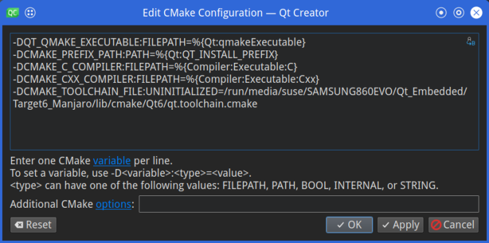

# Qt 6 Cross-Compilation for PinePhone
Revision Date : 2023/03/22 
  

# Preface  
**This article is Qt 6.2 Cross-Compile and Remote Debug for PinePhone.**  
**I am building a cross compile environment with Qt 6.2.4 (Manjaro ARM).**  
 
Here, my Linux PC is SUSE Enterprise 15 and openSUSE 15, my PinePhone (Beta) is Manjaro ARM(Phosh).  
When building Qt, please adapt to each user's environment.  
 
**Note:**  
**If you want to use the latest GCC AArch64 ToolChain,**  
**you need to build GCC yourself by referring to the URL shown below.**  
 

https://github.com/presire/How_to_create_GCC_ToolChain_for_PinePhone.git  
 
**It is easy to create and is recommended.**  
 
 

# 1. Qt Source Code Download and etc... (Linux PC)
On a Linux PC, install the following dependency libraries.  

        sudo zypper install autoconf automake cmake unzip tar git wget pkg-config \
                            gperf gcc gcc-c++ gawk bison openssl flex figlet pigz \
                            ncurses-devel ncurses5-devel
 

When cross-compiling with Qt 6, the Qt library for x86 64 is also required.  
Therefore, install the Qt libraries for x86 64 using Qt online installer.  
 

**You can also build and install the Qt 6 library for x86 64 from Qt 6 source code, but this is not recommended due to the complexity.**  
**Here, Qt library for host PC (x86 64) is install from Qt online installer.**  
 

        wget http://download.qt.io/official_releases/online_installers/qt-unified-linux-x64-online.run
 

Add execute permission to the downloaded file.  

        chmod +x qt-unified-linux-x64-online.run
 

Run the Qt online installer.  

        ./qt-unified-linux-x64-online.run
 

Follow the Qt installation screen to install Qt 6.  
 
 

# 2. Install the necessary dependencies for PinePhone and SSH Setting (PinePhone)
Create a directory for installing Qt libraries on PinePhone.  
*This directory will be used in the last part of this article.*  

    mkdir -p ~/InstallSoftware/Qt6
 

Get the latest updates on PinePhone.  

    # Manjaro
    sudo pacman -Syu
    sudo systemctl reboot
 

Install SSH server on PinePhone.  

    # Manjaro
    sudo pacman -S --needed openssh
 

Configure the SSH Server to start automatically, and start the SSH Server.  

    # Manjaro
    sudo systemctl enable sshd  
    sudo systemctl start  sshd  
 

Install the dependencies required to build the Qt Library.  

    # Manjaro
    sudo pacman -S --needed base-devel rsync vi vim util-linux-libs glib2 make cmake unzip pkg-config \
                            gdb gdb-common gdbm gcc gcc-libs gcc-fortran python2 python3 \
                            ccache icu lksctp-tools python-atspi zstd libinput libtsm mtdev \
                            libevdev libffi pcre pcre2 libwacom assimp fontconfig dbus dbus-c++ nss \
                            libxkbcommon alsa-lib libxinerama pugixml sqlite libxslt openssl ffmpeg \
                            wayland wayland-utils wayland-protocols egl-wayland waylandpp \
                            wrapland wlc wayfire glew-wayland glfw-wayland libva1 \
                            mesa mesa-utils glu libglvnd libb2 lttng-ust libproxy qt6ct
 

*If you want to use other features, you should also install the following dependencies.*  

**Manjaro**
* Bluetooth  
bluez bluez-tools bluez-libs bluez-utils	

* Photo  
openjpeg2 libjpeg-turbo libpng libtiff libmng  

* Codec  
ffmpeg v4l-utils xvidcore x264 x265  

* Multimedia  
gstreamer gstreamermm gst-plugins-base gst-plugins-base-libs gst-plugins-good
gst-plugins-bad gst-plugins-bad-libs gst-plugins-ugly gst-libav gst-plugin-wpe
gst-plugin-pipewire gst-plugin-gtk qt-gstreamer gst-plugin-qmlgl gst-plugin-opencv  

* ALSA audio  
alsa-lib  

* Pulse audio  
pulseaudio-alsa	 

* OpenAL audio  
openal  

* Text to Speech  
flite  

* Qt SerialPort  
libserialport  

* Database  
ODBC       : unixodbc  
PostgreSQL : postgresql-libs libpqxx  
MariaDB    : mariadb-clients mariadb-libs  
SQLite     : sqlite  

* Printer  
libcups  

* Accessibility  
at-spi2-core at-spi2-atk  

* SCTP  
lksctp-tools  
(To enable this, add the **-sctp** option when configuring.)  

* Webengine  
Required : flex bison gperf readline nss libdrm  
Option1 : libxml2 libxml++ libxslt minizip jsoncpp lcms2 libevent protobuf protobuf-c  
Option2(Be careful, as it is unstable.) : opus libvpx  
 

Use the rsync command to synchronize the files between Linux PC and PinePhone.  
However, **some of the files to be synchronized require root privileges.**  
 
Therefore, add the following settings to the /etc/sudoers file so that all files can be synchronized even by ordinary users.  
With the following settings, the rsync command will be executed with super user privileges if necessary.  

    echo "$USER ALL=NOPASSWD:$(which rsync)" | sudo tee --append /etc/sudoer
 

Restart PinePhone just in case.  

    sudo shutdown -r now
    # or
    sudo systemctl reboot
 
 

# 3. Download Qt source code
Qt Everywhere (recommended here)  
    wget https://download.qt.io/official_releases/qt/6.2/6.2.4/single/qt-everywhere-src-6.2.4.tar.xz
    tar xf qt-everywhere-opensource-src-6.2.4.tar.gz
 
   

# 4. Download the Qt target file from this Github (Linux PC)
    git clone https://github.com/presire/Qt6_CrossCompile_for_PinePhone.git
    
    cp -r Qt6_CrossCompile_for_PinePhone/linux-pinephone-g++ qt-everywhere-src-6.2.4/qtbase/mkspecs/devices  
 

In the downloaded and copied qmake.conf, 
comment **DISTRO_OPTS += deb-multi-arch** if you want to use Manjaro ARM. 

    vi qt-everywhere-src-6.2.4/qtbase/mkspecs/devices/linux-pinephone-g++/qmake.conf
 

    # qt-everywhere-src-6.2.4/qtbase/mkspecs/devices/linux-pinephone-g++/qmake.conf file
    
    ...

    # If you use Manjaro ARM, you need to comment it.
    #DISTRO_OPTS += deb-multi-arch

    ...
 
 

# 5. Download & Install Wayland-Scanner (Linux PC)
You need to install **Meson** & **Ninja** for building **Wayland-Scanner**.  

    git clone https://github.com/wayland-project/wayland.git  
    cd wayland && mkdir build  

    meson ./build/ --prefix=<Install Directory for Wayland-Scanner> -Ddocumentation=false  
    ninja -C build/ install  
    
    cp /<Install Directory for Wayland-Scanner>/bin/wayland-scanner /<Qt Tool for Linux PC>/bin  
 
 

# 6. Download PinePhone's System Root (Linux PC)
It is necessary to synchronize with the root directory of PinePhone, create the system root directory.  

    mkdir -p ~/<System Root PinePhone> && \  
             ~/<System Root PinePhone>/usr && \  
             ~/<System Root PinePhone>/usr/share  
 

    rsync -avz --rsync-path="sudo rsync" --delete --rsh="ssh" <PinePhone's User Name>@<PinePhone's IP Address or Host Name>:/lib ~/<System Root PinePhone>/  
    rsync -avz --rsync-path="sudo rsync" --delete --rsh="ssh" <PinePhone's User Name>@<PinePhone's IP Address or Host Name>:/usr/lib ~/<System Root PinePhone>/usr  
    rsync -avz --rsync-path="sudo rsync" --delete --rsh="ssh" <PinePhone's User Name>@<PinePhone's IP Address or Host Name>:/usr/include ~/<System Root PinePhone>/usr  
    rsync -avz --rsync-path="sudo rsync" --delete --rsh="ssh" <PinePhone's User Name>@<PinePhone's IP Address or Host Name>:/usr/share/pkgconfig ~/<System Root PinePhone>/usr/share  
 
 

# 7. Edit CMake toolchain file
Edit CMake tool chain file to be used in building Qt 6 library for the target.  

        vi Qt6ToolChain_for_PinePhone.cmake
 

* "TARGET_SYSROOT"  
  Specify the system root directory of PinePhone.  

* "CMAKE_C_COMPILER"  
  Specify path to cross-compiler. (Ex: /home/user/bin/aarch64-unknown-linux-gnu-gcc)  

* "CMAKE_CXX_COMPILER"  
  Specify path to cross-compiler. (Ex: /home/user/bin/aarch64-unknown-linux-gnu-g++)  

 
 

# 8. Build Qt Source Code (Linux PC)
Build the Qt source code.  

    # Set path to Wayland Scanner
    export PATH="/<Path to Wayland Scanner>/bin:$PATH"
    export LD_LIBRARY_PATH="/<Path to Wayland Scanner>/lib64:$LD_LIBRARY_PATH"

    # Set PinePhone's system root directory
    export SYSROOT=<PinePhone's system root directory>

    # Set Pkg-Config
    export PKG_CONFIG_PATH="$SYSROOT/usr/lib/pkgconfig:$SYSROOT/usr/lib/aarch64-linux-gnu/pkgconfig"
    export PKG_CONFIG_LIBDIR="$SYSROOT/usr/lib/pkgconfig:$SYSROOT/usr/lib/aarch64-linux-gnu/pkgconfig:$SYSROOT/usr/share/pkgconfig"

    # Set Cross-Compiler
    export CROSS_COMPILER="/<Path to Cross-Compile's toolchain>/bin/aarch64-linux-gnu-"
    # or
    # export CROSS_COMPILER="/<Path to Cross-Compile's toolchain>/bin/aarch64-unknown-linux-gnu-"

    cmake -G Ninja \
    ../qt-everywhere-src-6.2.4          \
    -DCMAKE_BUILD_TYPE=Release          \
    -DQT_FEATURE_eglfs_egldevice=ON     \
    -DQT_FEATURE_eglfs_gbm=ON           \
    -DCMAKE_TOOLCHAIN_FILE=<Path to CMake toolchain file>   \
    -DQT_BUILD_TOOLS_WHEN_CROSSCOMPILING=ON                     \
    -DQT_QMAKE_TARGET_MKSPEC=devices/linux-pinephone-g++        \
    -DQT_QMAKE_DEVICE_OPTIONS=CROSS_COMPILE=$CROSS_COMPILER     \
    -DQT_BUILD_EXAMPLES=OFF  \
    -DQT_BUILD_TESTS=OFF     \
    -DBUILD_qtdoc=OFF        \  # If not install QtDoc
    -DBUILD_qtwebengine=OFF  \  # If not install QtWebEngine
    -DBUILD_qtwebview=OFF    \  # If not install QtWebView
    -DBUILD_qtwebchannel=OFF \  # If not install QtWebChannel
    -DCMAKE_SYSROOT=$SYSROOT \
    -DQT_HOST_PATH=<Path to Qt6 install directory for x86 64  Ex: /home/user/Qt/6.2.4/gcc_64>  \
    -DCMAKE_STAGING_PREFIX=<Install Qt6 libraries directory for PinePhone>  \
    -DCMAKE_INSTALL_PREFIX=<Qt6 project directory>                          \
    -DCMAKE_PREFIX_PATH=$SYSROOT/usr/lib
 

Build and Install.  

    cmake --build . --parallel $(nproc)
    cmake --install .
 

Go to the cross-compiled Qt 6 installation directory.  
Create a symbolic file for the **host-qmake** file in bin directory.  
(in this case, **qmake-host** file).  

        cd <cross-compiled Qt 6 installation directory>
        ln -s host-qmake qmake-host
 

# 9. Upload Qt Library (Linux PC)
Deploy the built Qt library to PinePhone.  

    rsync -avz --rsh="ssh" --delete /<Above, Qt Library for PinePhone>/* \  
    <PinePhone's User Name>@<PinePhone's IP Address or Host Name>:/home/<PinePhone's User Name>/InstallSoftware/Qt6  
 
 

# 10. Settings Qt Creator
## 10.1 Qt Creator General Settings  
Launch Qt Creator.  
 

* Setting up the Qt compiler AArh64 Toolchain.  
Qt Creator - [Tool] - [Option] - [Kits] - [Compiler] -[Add] - [GCC] - [C]  
/<AArch64 Toolchain's Directory>/bin/aarch64-linux-gnu-gcc  
Qt Creator - [Tool] - [Option] - [Kits] - [Compiler] -[Add] - [GCC] - [C++]  
/<AArch64 Toolchain's Directory>/bin/aarch64-linux-gnu-g++  

* Setting up the Qt Debugger AArh64 Toolchain.  
Qt Creator - [Tool] - [Option] - [Kits] - [Debugger] -[Add]  
/<AArch64 Toolchain's Directory>/bin/aarch64-linux-gnu-gdb  

* Setting up the Qt Qmake for Qt Cross-Compile.  
Qt Creator - [Tool] - [Option] - [Kits] - [Qt version] -[Add]  
/<Qt Tool for Linux PC's Directory>/bin/qmake-host  

* Setting up the Qt Qmake for Qt Cross-Compile.  
Qt Creator - [Tool] - [Option] - [Kits] - [Kits] -[Add]  
Compiler : The compiler configured above  
Debugger : The debugger configured above  
Qt version : The Qmake configured above  
Qt mkspec : /<Qt Tool for Linux PC's Directory>/mkspecs/devices/linux-pinephone-g++  
Sysroot(It can be set or unset) : /\<System Root PinePhone\>  

* Setting Add GDB Start Command.  
Qt Creator - [Tool] - [Option] - [Debugger] - [GDB]Tab  
Additional Startup Commands : set sysroot target:/  

* Setting Kit.  
  1. [Kits] on the left of [Preferences] screen - From the [Kits] tab on the right of [Preferences] screen, click the [Add] button.  

  2. Select [Remote Linux Device] from [Devices Type] pull-down.  
   
  3. From [Device] pull-down, select target you created in [Device] on the left side of [Preferences] screen.  
  
  4. Select [Local PC] from [Build device] pull-down.  

  5. Select AArch64 ToolChain from [Compiler] pull-down.  

  6. Select AArch64 GDB from [Debugger] pull-down.  

  7. Select Qt 6.2.4 from [Qt version] pull-down.  

  8. Select /<Path to Cross-Compiled Qt6 Install directory>/mkspecs/devices/linux-pinephone-g++ from [Debugger] pull-down.  

  9. In [CMake Configuration], click [Change...] button.  
     Input the settings shown below.  **\*1**  
      
     **-DCMAKE_TOOLCHAIN_FILE:UNINITIALIZED=/<Path to Cross-Compiled Qt6 Install directory>/lib/cmake/Qt6/qt.toolchain.cmake**  
      
     Press [Apply] button.  
      

     NOTE:  **\*2**  
     This setting can be set by selecting [Projects] - [Build & Run] - [Build] on the left side screen of Qt Creator.  
     It can be set for each project by editing the value of **CMAKE_TOOLCHAIN_FILE** in [Build Settings] in the right pane of Qt Creator main screen.  

     |CMake Configuration *1|CMake Configuration *2|
     |---|---|
     |||

 
 

# 11 Settings Qt Project  
Launch Qt Creator and Open, and after create Qt Project.  
 

Qt Creator - [Project] - [Run] - [Run Settings] - [Environment] - [Details] - [Add]  
then, Click [Fetch Device Environment]Button.  
**<u>when you run the debugger, Be sure to click on [Fetch Device Environment]Button.</u>**  

* Variable - QT_QPA_PLATFORMTHEME  
Value - qt6ct  
     
* Variable : DISPLAY  
Value : 0  or   Value : 0.0  
 
* Variable : LD_LIBRARY_PATH  
Value : /home/<PinePhone's User Name>/InstallSoftware/Qt6/lib:/home/<PinePhone's User Name>/InstallSoftware/Qt6/plugins/qmltooling  
 
* Variable : QML_IMPORT_PATH  
Value : /home/<PinePhone's User Name>/InstallSoftware/Qt6/qml  
 
* Variable : QML2_IMPORT_PATH  
Value : /home/<PinePhone's User Name>/InstallSoftware/Qt6/qml  
 
* Variable : QT_PLUGIN_PATH  
Value : /home/<PinePhone's User Name>/InstallSoftware/Qt6/plugins  
 
* Variable : QT_QPA_PLATFORM_PLUGIN_PATH  
Value : /home/<PinePhone's User Name>/InstallSoftware/Qt6/plugins/platforms  

 
 

# 12. Warning and Error related  
## 12.1 Debug start speed issues  
When you debug remote targets, GDB Debugger is looking in the local PinePhone's System-Root directory for the libraries.  
So just need to tell GDB Debugger to load the remote PinePhone's System-Root from the remote target.  
 
<u>but, <code>"set sysroot target:/"</code> takes a long time to start debugging,</u>  
so writing the following setting will speed up the start of debugging.  
 
First, Create the directories and symbolic links shown below.  

    mkdir -p /<PinePhone's System-Root Directory>/home/<PinePhone's User Name>/InstallSoftware  
    ln -s /<Qt Library for PinePhone> /<PinePhone's System-Root Directory>/home/<PinePhone's User Name>/InstallSoftware  
    mv /<PinePhone's System-Root Directory>/home/<PinePhone's User Name>/InstallSoftware/<Qt Library for PinePhone> \  
       /<PinePhone's System-Root Directory>/home/<PinePhone's User Name>/InstallSoftware/Qt6  
 

Next, Write the following settings.  
Qt Creator - [Tool] - [Option] - [Debugger] - [GDB]Tab - [Additional Startup Commands]  

    set sysroot /＜System Root PinePhone＞  
 

Make sure you can debug Qt project.  
